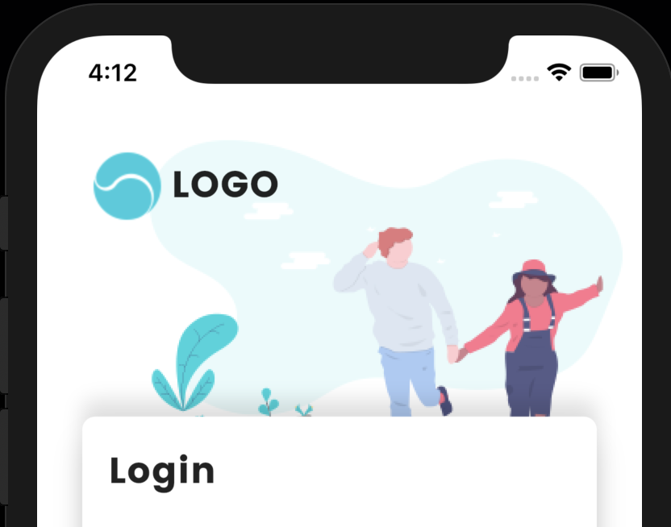

# Flutter-Login-Page-UI-Explained

Este pequeño tutorial es una explicación del video del desarrollador llamado Abdi Hamid, todo el código es propiedad del desarrollador, lo único que estoy haciendo es explicar algunas de las partes para que cualquier persona que esté iniciando en Flutter lo pueda entender. Ante todo gracias a [Abdi Hamid](https://github.com/devefy) por compartir el video y el código en su repositorio. 

El resultado final con este ejemplo es el siguiente:


En la carpeta lib del proyecto vamos a encontrar cuatro archivos, estos son los que crea Abdi en el video y son los que componene toda el login de la App, estos son:

* main.dart
* CustomIcons.dart
* SocialIcons.dart
* FormCard.dart

En Flutter es muy sencillo ver como se desarrolla toda la composición de la app, simplemente viendo cada Widget y como esta contenido un Widget en otro, esto permite facilmente poder leer y luego interpretar que esta haciendo cada Widget.

Inicamos con el StatefulWidget.

```dart
class MyApp extends StatefulWidget {
  @override
  _MyAppState createState() => new _MyAppState();
}

class _MyAppState extends State<MyApp> {
  bool _isSelected = false;

  void _radio() {
    setState(() {
      _isSelected = !_isSelected;
    });
  }
```
Un widget que tiene un estado mutable. State es información que se puede leer de forma sincrónicamente y puede cambiar durante el tiempo de vida del widget, es responsabilidad del implementador asegurar que el State es notificado cuando se genera un cambio, por medio del State.setState.

El Stateful widget es muy util cuando parte de la interfaz de usuario que estamos creando cambia dinamicamente, esta es la diferencia entre el Stateful Widget y el Stateless Widget.

Podemos ver que en el código anterior se usa el Stateful y luego se define el State que más adelante vamos a usar para notificar en los cambios realizados en el Login, por ejemplo cuando se activa el radioButton para recordar los datos de la persona que se va a loggear, en estas situaciones donde el usuario interactua con la app, que debemos hacer uso del StatefulWidget y notificar por medio del State.setState, si hacemos todo esto pero usando el Stateless, no se va dar el cambio en el radioButton.

En este punto puede surgir la pregunta sobre por que el Stateful y el State se definen de forma separada? Los objetos State son de larga vida, pero el StatefullWidget se desecha y se reconstruyen cada vez que cambia la configuración. Como el State no se pierde en cada rebuild, evita cálculos costosos, y obtiene propiedades del State, getters, setters, etc. cada vez que se reconstruye frame a frame.

Lo importante es que esto es lo que permite que existan animaciones en Flutter. Como el State no se desecha, se puede reconstruir constantemente su Widget en respuesta a los cambios en los datos, y cuando sea necesario, si es necesario.


En la siguiente sección se define el Widget radioButton, su tamaño, ubicación, la forma y el color, en el child se usa un operador ternario para reemplazar el if y hacer el código más organizado, es facíl entender este operador si seguimos la siguiente relación WTF, en la cual W es la pregunta el que?, luego la T es el True, lo que se implementa si la condición es verdadera y luego la F es el false, lo que se implementa si no se cumple, en este caso el isSelected es la pregunta o la parte W, despues del signo de interrogación ?, luego despues de los dos puntos : vamos a encontrar la parte F del operador ternario.


```dart
Widget radioButton(bool isSelected) => Container(
        width: 16.0,
        height: 16.0,
        padding: EdgeInsets.all(2.0),
        decoration: BoxDecoration(
            shape: BoxShape.circle,
            border: Border.all(width: 2.0, color: Colors.black)),
        child: isSelected // W
            ? Container( // T
                width: double.infinity,
                height: double.infinity,
                decoration:
                    BoxDecoration(shape: BoxShape.circle, color: Colors.black),
              )
            : Container(), // F
      );
```
Después de definir el radioButton, vamos a iniciar con uno de los bloque de código más grandes de toda nuestra app donde se define la mayoria de la estructura del proyecto el Widget build, que hace parte de todo el ciclo de vida del Stateful Widget, Este método se llama a menudo (fps + render). Es obligatorio, hacer un @override y debe devolver un Widget.

Podemos ver como inicia con el @override y al final como retorna un Widget, en este caso un Scaffold.

```dart
@override
  Widget build(BuildContext context) {
    ScreenUtil.instance = ScreenUtil.getInstance()..init(context);
    ScreenUtil.instance =
        ScreenUtil(width: 750, height: 1334, allowFontScaling: true);
    return new Scaffold
 ```
Pero acá hay un package que se esta utilizando y es importante saber que hace, el ScreenUtil. Un plugin para Flutter para adaptar la pantalla y el tamaño de fuente. ¡Deje que su interfaz de usuario muestre un diseño razonable en diferentes tamaños de pantalla!

Para instalar este plugin en Flutter debemos agregar la siguiente línea en el archivo pubsec.yaml y esto instalara las dependencias necesarias para poder utilizarlo.

* flutter_screenutil: ^0.4.2

En el siguiente link podemos encontrar más información al respecto: [ScreenUtil](https://github.com/OpenFlutter/flutter_screenutil)

Nuestro build retorna un Scaffold, veamos una breve explicación de este y cada uno de los Widgets que contiene:

**Scaffold:** Implementa la estructura básica de Material Design. Esta clase proporciona la API para mostrar drawers, Snack Bars y bottom sheets.

**Stack:** Un widget que coloca a sus children en relación con los bordes de su caja. Esta clase es útil si desea superponer a varios child de una manera sencilla, por ejemplo, con algo de texto y una imagen, superpuesta con un degradado y un botón adjunto en la parte inferior.

Podemos ver como luego del Stack, se definen los children:

```dart
Stack(
        fit: StackFit.expand,
        children: <Widget>[
          Column(
            crossAxisAlignment: CrossAxisAlignment.end,
            children: <Widget>[
 ```
 **Padding:** El padding permite generar un espacio entre la ubicación del contenido y el borde de la caja, es más fácil identificarlos cuando cambiamos el valor de 20 a 50. La imagen izquierda tiene un padding de 20 y la derecha de 50.
 
   
 
 

